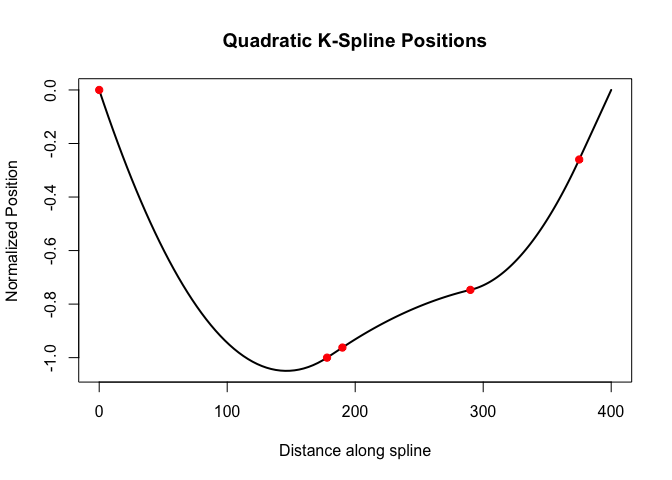

# splineOP Vignette

### Vincent Runge

#### LaMME, Evry University, October 27, 2025

> [Quick start](#start)

> [Models And Data Generators](#Models)

> [splineOP](#splineOP)

## Quick start

### Introduction

### Installing the dust Rcpp package

**REQUIREMENTS:** - R &gt;= 3.4 - devtools :
`install.packages('devtools')`

The package can then be installed from the github repo with the
following command:

    devtools::install_github("vrunge/splineOP")

and imported with:

    library(splineOP)

### A simple example

We generate some 1D time series of length `400` from the Gaussian model
and one change in the middle of the sequence.

    library(splineOP)
    # Example with 5 segments and given accelerations
    segments <- generate_segment_lengths(400, 5)
    accelerations <- rnorm(5)
    result <- generate_Qsplines(segments, accelerations, max1 = TRUE)
    #'
    # Inspect results
    result$p  # positions

    ## [1]  0.0000000 -1.0000000 -0.9623135 -0.7468151 -0.2598189

    result$v  # velocities

    ## [1] -0.014347548  0.003111593  0.003169492  0.001140476  0.010318258

    result$a  # accelerations

    ## [1]  9.808506e-05  4.824925e-06 -2.029016e-05  1.079739e-04  5.959753e-06

    #'
    # Plot positions along the spline
    plot_Qspline(result, segments)

[(Back to Top)](#top)

## Models And Data Generators

### Quadratic Splines

### Data Generators

[(Back to Top)](#top)

## splineOP

[(Back to Top)](#top)
